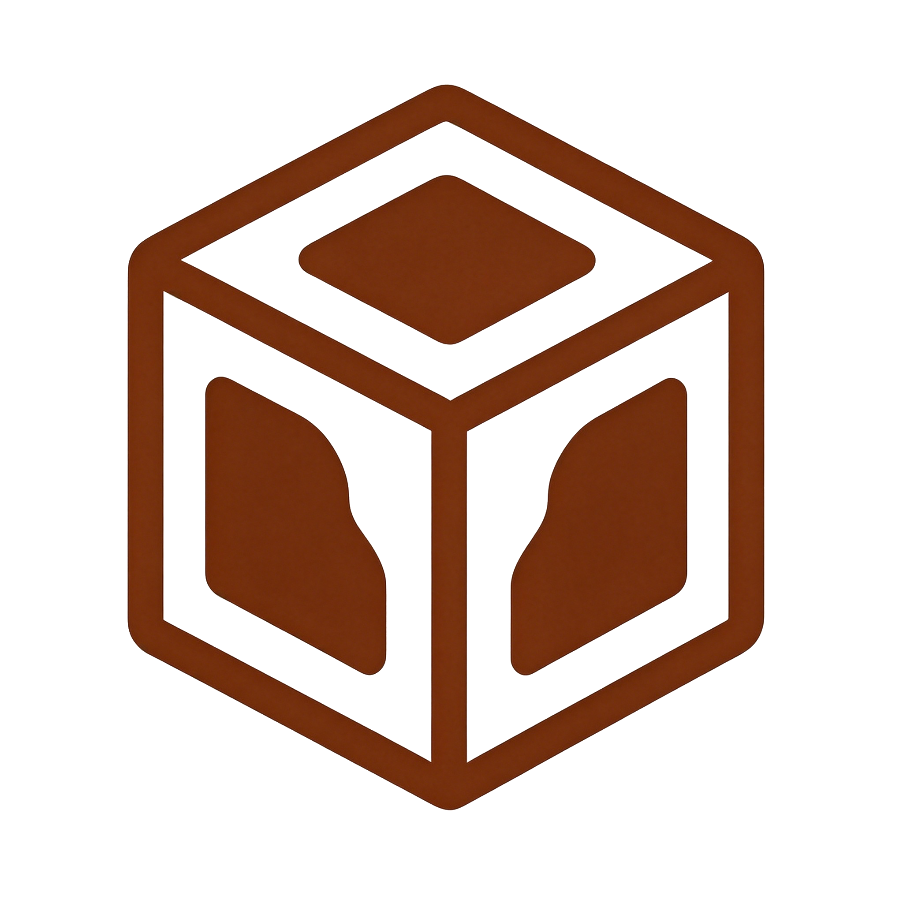

<div align="center">
  
  <h1>ShitEngine</h1>
  <p><strong>基于 C++20 与 SDL3 的轻量级 2D 游戏引擎</strong></p>
  <p>
    <a href="https://github.com/ShitTeam/ShitEngine/actions">构建</a>
    · <a href="https://github.com/ShitTeam/ShitEngine">源代码</a>
    · <a href="https://engine.shitteam.top">文档</a>
  </p>
</div>

## 概述

ShitEngine 是一个从零构建、面向对象 + 组件化的轻量级 2D 游戏引擎，以 SDL3 作为渲染与平台后端。引擎内置完整的生命周期管理、场景栈、多相机渲染管线、资源缓存、类型安全的事件总线与分层音频系统，在保持小体积的同时提供开箱即用的基础设施，适用于 2D 像素风游戏的快速原型开发、游戏开发教学与引擎原理研究。

## 特性

- **组件化架构** — `GameObject` 持有 `Component`，`System` 负责更新/渲染；`Behavior` 作为用户脚本基类，由 `BehaviorSystem` 自动驱动 `onStart/onUpdate`
- **多相机渲染管线** — 支持分屏、比例视口、按 zIndex 的渲染排序与 letterbox 等比缩放
- **像素完美渲染** — 全局 1280×720 逻辑分辨率 + 最近邻缩放 + 像素对齐，像素风无模糊、无抖动
- **逐帧动画** — `SpriteSheet` 按“行 × 列”网格切割精灵图集，`AnimationComponent` 以帧索引数组定义并播放动画，每帧自动回写源矩形
- **分层音频系统** — `AudioPlayer` 单例驱动 `AudioTrack` / `AudioTrackGroup`，增益层级为 `master × group × track`，支持暂停/恢复/停止与自动回收
- **类型安全事件总线** — `EventBus` 采用缓冲队列模式，回调内可安全订阅/派发，避免递归派发与迭代器失效
- **场景栈管理** — 场景推入/弹出/替换支持延迟执行，保证切换期间不破坏正在迭代的集合
- **资源自动缓存** — 纹理、音频、字体经 `ResourceManager` 统一懒加载与 RAII 回收
- **三态输入** — 键盘与鼠标的 `Down / Pressed / Released` 状态检测
- **结构化日志** — 基于 spdlog 的多级日志、引擎日志与用户日志分离
- **JSON 配置** — `settings.json` 配置窗口、帧率等参数，缺失时以安全默认回退

## 架构

```
Game            引擎主循环（Init / Run / Destroy）
├── Window          SDL3 窗口管理
├── Renderer        SDL3 渲染器封装（逻辑分辨率、绘制 API）
├── Time            DeltaTime / TotalTime / 帧率限制
├── Input           键盘 & 鼠标三态输入
├── Config          JSON 配置读取
├── ResourceManager 纹理 / 音频 / 字体资源缓存
├── AudioPlayer      分层音频（master × group × track）
├── EventBus        缓冲队列事件总线
└── SceneManager    场景栈
    └── Scene
        ├── BehaviorSystem   驱动 Behavior 生命周期
        ├── RenderSystem     多相机渲染管线
        └── GameObject
            ├── TransformComponent
            ├── Behavior（用户继承）
            ├── AnimationComponent  逐帧动画（sprite-sheet）
            └── RendererComponent（渲染组件基类）
                ├── SpriteRenderer
                └── CameraComponent
```

## 快速开始

### 环境要求

- C++20 编译器（GCC 10+、Clang 11+、MSVC 2019+）
- CMake 3.20+

> 第三方依赖（SDL3 / SDL3_image / SDL3_mixer / SDL3_ttf、spdlog、glm、nlohmann_json）由 CMake 自动拉取或随预编译包自带。

### 方式一：CMake FetchContent（推荐）

```cmake
cmake_minimum_required(VERSION 3.20)
project(MyGame)

include(FetchContent)
FetchContent_Declare(
    ShitEngine
    GIT_REPOSITORY https://github.com/ShitTeam/ShitEngine.git
    GIT_TAG main
    GIT_SHALLOW TRUE
)
FetchContent_MakeAvailable(ShitEngine)

add_executable(MyGame main.cpp)
target_link_libraries(MyGame PRIVATE ShitEngine::ShitEngine)
```

所有依赖由 CMake 自动拉取，无需手动安装。

### 方式二：add_subdirectory（本地源码）

```cmake
add_subdirectory("path/to/ShitEngine" "${CMAKE_BINARY_DIR}/ShitEngine_Build")
target_link_libraries(MyGame PRIVATE ShitEngine::ShitEngine)
```

### 方式三：find_package（预编译库）

从 GitHub Release 下载解压后，artifact 结构如下：

```
ShitEngine/
├── bin/          # ShitEngine.dll (Release) + ShitEngine-d.dll (Debug) + 第三方 DLL
├── lib/          # 导入库 + ShitEngineConfig.cmake
└── include/      # 头文件
```

在你的 CMakeLists.txt 中：

```cmake
find_package(ShitEngine REQUIRED
    PATHS /path/to/ShitEngine/lib/cmake
    NO_DEFAULT_PATH)
add_executable(MyGame main.cpp)
target_link_libraries(MyGame PRIVATE ShitEngine::ShitEngine)
```

`ShitEngineConfig.cmake` 会依据 `CMAKE_BUILD_TYPE` 自动选择对应导入库（Debug 版本文件名带 `-d` 后缀）。预编译包自带第三方动态库，无需额外安装 SDL3 等依赖。

> **Linux 用户**：运行前需设置动态库路径：
> ```bash
> export LD_LIBRARY_PATH=/path/to/ShitEngine/lib:$LD_LIBRARY_PATH
> ```

## 使用示例

### 基础：场景 / 相机 / 脚本

```cpp
#include <ShitEngine.h>

class Player : public Shit::Behavior {
    Shit::TransformComponent* transform = nullptr;
    float speed = 200.0f;

    void onStart() override {
        transform = getOwner()->getComponent<Shit::TransformComponent>();
    }

    void onUpdate() override {
        Shit::Vector2 pos = transform->getPosition();
        if (Shit::Input::IsKeyPressed(Shit::KeyCode::W)) pos.y -= speed * Shit::Time::GetDeltaTime();
        if (Shit::Input::IsKeyPressed(Shit::KeyCode::S)) pos.y += speed * Shit::Time::GetDeltaTime();
        if (Shit::Input::IsKeyPressed(Shit::KeyCode::A)) pos.x -= speed * Shit::Time::GetDeltaTime();
        if (Shit::Input::IsKeyPressed(Shit::KeyCode::D)) pos.x += speed * Shit::Time::GetDeltaTime();
        transform->setPosition(pos);
    }
};

int main() {
    if (Shit::Game::Init()) {
        auto scene = std::make_unique<Shit::Scene>("example");
        scene->init();

        auto go = std::make_unique<Shit::GameObject>("player");
        go->addComponent<Shit::TransformComponent>();
        go->addComponent<Shit::SpriteRenderer>()->setTexturePath("textures/player.png");
        go->addComponent<Player>();
        scene->addGameObject(std::move(go));

        auto camera = std::make_unique<Shit::GameObject>("camera");
        camera->addComponent<Shit::TransformComponent>();
        camera->addComponent<Shit::CameraComponent>()->setZoom(5.0f);
        scene->addGameObject(std::move(camera));

        Shit::SceneManager::PushScene(std::move(scene));
        Shit::Game::Run();
    }
    Shit::Game::Destroy();
}
```

### 网格精灵动画

```cpp
auto* sprite = go->addComponent<Shit::SpriteRenderer>();
sprite->setTexturePath("textures/player.png");   // 4 行 8 列、每帧 32×32 的精灵图集

auto* anim = go->addComponent<Shit::AnimationComponent>();
Shit::SpriteSheet sheet(4, 8, 32, 32);              // rows, cols, frameW, frameH

// 用帧索引数组定义动画（可跳帧、可不连续）
anim->play("walk",   sheet, {0, 1, 2, 3, 4, 5},     0.1f, /*loop=*/true);
anim->play("jump",   sheet, {24, 25, 26},            0.08f, /*loop=*/false);
anim->play("attack", sheet, {16, 17, 19, 20, 23},   0.06f, /*loop=*/false);

anim->play("walk");   // 切换播放
```

> `SpriteSheet` 仅负责按网格计算源矩形，纹理统一由 `SpriteRenderer` 的 `texturePath` 提供；`AnimationComponent` 每帧把当前帧矩形回写至 `SpriteRenderer::setSourceRect`，因此图集必须与渲染所用纹理一致。

### 分层音频

```cpp
auto* bgm = Shit::AudioPlayer::Play("audio/bgm.mp3");           // 归入 "default" 组
auto* fx  = Shit::AudioPlayer::Play("audio/step.mp3", "sfx");   // 归入 "sfx" 组（按需自动创建）

Shit::AudioPlayer::SetMasterVolume(0.8f);                        // master × group × track
auto* sfxGroup = Shit::AudioPlayer::GetTrackGroup("sfx");
if (sfxGroup) sfxGroup->setVolume(0.5f);                        // 实际增益 = 0.8 × 0.5 × track
```

### 事件总线

```cpp
struct PlayerHit : Shit::Event { int damage; };

auto token = Shit::EventBus::Subscribe<PlayerHit>(
    [](const PlayerHit& e) { /* 处理 */ });
Shit::EventBus::Emit(PlayerHit{10});          // 入队，下一帧统一派发
Shit::EventBus::Unsubscribe<PlayerHit>(token);
```

### 多相机分屏

```cpp
camera1->getComponent<Shit::CameraComponent>()->setViewportRatio({0.0f, 0.0f, 0.5f, 1.0f}); // 左半屏
camera2->getComponent<Shit::CameraComponent>()->setViewportRatio({0.5f, 0.0f, 0.5f, 1.0f}); // 右半屏
```

### 配置

创建 `settings.json` 与可执行文件同目录：

```json
{
    "project": "MyGame",
    "window": {
        "title": "My Game",
        "width": 1024,
        "height": 720,
        "targetFPS": 144
    }
}
```

## 更多

- [GitHub 仓库](https://github.com/ShitTeam/ShitEngine) — 源代码与 Issues
- [文档网站](https://engine.shitteam.top) — API 参考与教程

## 许可证

Apache License 2.0
