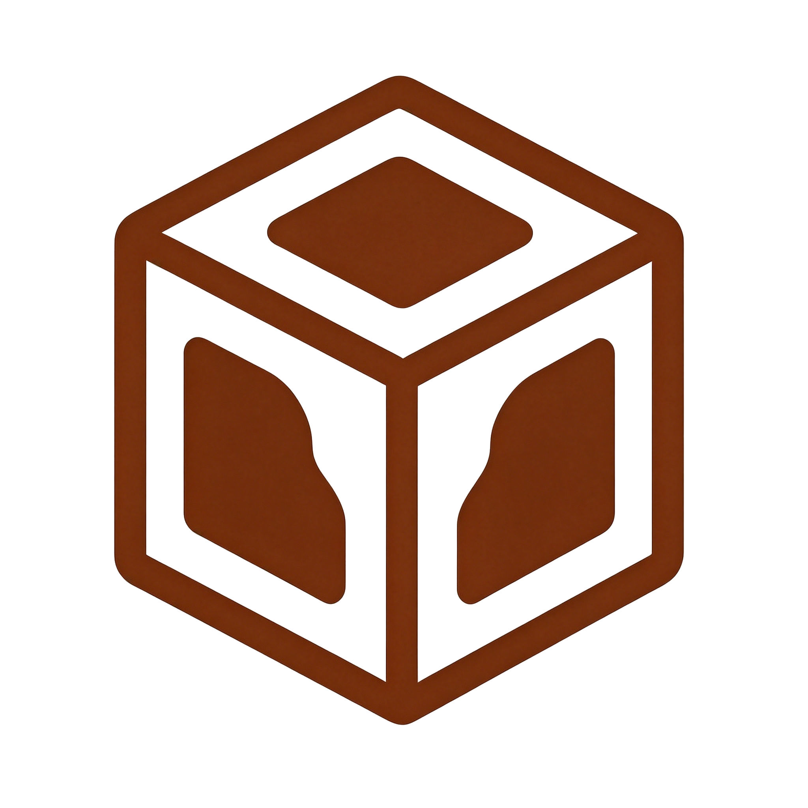

<div align="center">
  
  <h1>ShitEngine</h1>
  <p><strong>基于 C++20 与 SDL3 的轻量级 2D 游戏引擎</strong></p>
  <p>
    <a href="https://github.com/ShitTeam/ShitEngine/actions/workflows/build.yml"></a>
    
    
    
    
    
    <a href="https://deepwiki.com/ShitTeam/ShitEngine"></a>
  </p>
  <p>
    <a href="https://github.com/ShitTeam/ShitEngine/actions">构建</a>
    · <a href="https://github.com/ShitTeam/ShitEngine">源代码</a>
    · <a href="https://engine.shitteam.top">文档</a>
  </p>
</div>

## 概述

ShitEngine 是一个从零构建、面向对象 + 组件化的轻量级 2D 游戏引擎，以 SDL3 作为渲染与平台后端。引擎内置场景管理、多相机渲染管线、反射序列化、分层音频、类型安全事件总线、Box2D 物理与 Retained-Mode UI 系统；同时附带一个 **Qt 可视化编辑器**（场景树 / 属性检查器 / 双视口 / Gizmo / 撤销重做 / 播放调试 / 导出游戏），支持以"编辑器 + 行为脚本"的 Unity 式工作流开发游戏。适用于 2D 像素风游戏的快速原型开发、游戏开发教学与引擎原理研究。

## 特性

- **组件化架构** — `GameObject` 持有 `Component`，`System` 负责更新/渲染；`Behavior` 作为用户脚本基类，由 `BehaviorSystem` 自动驱动 `onStart/onUpdate`
- **数据驱动场景** — 场景只来自 `.scene` 文件：编辑器、Runtime、关卡切换共用同一 `SceneSerializer`（反射 + JSON，v2 层级格式）；组件字段经 `SHIT_REFLECT` 反射标记自动序列化
- **编译期反射** — libClang 扫描 `SHIT_REFLECT/SHIT_META/SHIT_ENUM` 宏生成 `.gen.h`；`TypeRegistry` 运行时按名称 / `type_index` 查询字段元信息，`ComponentRef<T>` 引用字段存组件 UUID，跨编辑会话稳定且永不悬垂
- **动画状态机** — `Animator`（继承 Behavior）状态集 + 转换 + float/bool/trigger 参数驱动，支持"任意状态"转换与 `.anim` 剪辑资产；`AnimationClip` 可序列化（支持每帧独立时长），兼容旧 `AnimationComponent` 动态播放
- **多相机渲染管线** — 分屏、比例视口、按 zIndex 排序、letterbox 等比缩放与最近邻像素对齐
- **瓦片地图** — `Tilemap` 组件把瓦片集纹理按网格铺排成地图，反射字符串载体持久化网格数据，编辑器内左键+Shift 刷瓦片
- **2D 物理** — Box2D 3.x 封装：`RigidBody2D` / 碰撞体 / `Joint2D` 关节（距离/铰链/焊接/滑动），自愈注册；物理接触驱动 `Behavior::onCollisionEnter/Stay/Exit` 碰撞回调
- **分层音频系统** — `AudioPlayer` 驱动 `AudioTrack` / `AudioTrackGroup`，增益层级 `master × group × track`，自动回收；`AudioSource` 组件挂载即播、可序列化
- **内置 UI 系统** — Canvas / Image / Text / Button / TextInput（含 IME 中文输入），UIRenderSystem 独立于游戏渲染管线叠加绘制
- **类型安全事件总线** — `EventBus` 缓冲队列模式，回调内可安全订阅/派发
- **动作/轴输入映射** — 键鼠三态（Down/Pressed/Released）+ `settings.json` / `config.json` 动作轴映射，编辑器「项目设置」页可视化编辑
- **插件架构** — 插件 DLL = 脚本库（只导出身份 + `RegisterPluginTypes`），Runtime 与编辑器共用 `PluginManager`，C++ 行为可实例化/编辑/序列化
- **Qt 可视化编辑器** — 进程内嵌引擎预览：场景树、属性检查器（反射字段 + 拖拽引用 + **文件拖入自动填充路径字段**）、双视口、Gizmo 移动/旋转/缩放、撤销/重做、Unity 式播放三态（运行/暂停/停止 + 运行前快照回滚）、瓦片刷图、物理碰撞体/关节调试绘制、Animator 状态机图与帧动画 Dope Sheet 窗口、Unity 风格资源窗口、一键导出绿色免安装游戏包
- **文件日志落盘** — 引擎与编辑器日志实时写入项目 `.shitengine/log/`（按启动时间归档、逐条 flush），进程崩溃时最后一段日志不丢失，配合编辑器日志面板排查问题

## 架构

```
Game                引擎主循环（Init / Run / Destroy，EngineContext 多实例）
├── Window             SDL3 窗口管理
├── Renderer           SDL3 渲染器封装（逻辑分辨率、绘制 API）
├── Time               DeltaTime / TotalTime / 帧率限制
├── Input              三态键鼠 + 动作/轴映射（config/settings inputMappings）
├── Config             settings.json / config.json 配置读取
├── ResourceManager    纹理 / 音频 / 字体资源缓存（RAII 回收）
├── AudioPlayer        分层音频（master × group × track）
├── EventBus           缓冲队列事件总线
├── TypeRegistry       反射类型注册表（libClang 扫描生成 .gen.h）
├── PluginManager      插件 DLL 加载 / 卸载（引擎层，Runtime 与编辑器共用）
└── SceneManager       单一当前场景（LoadScene / LoadSceneFromFile）
    └── Scene
        ├── BehaviorSystem      驱动 Behavior onStart/onUpdate（priority 0）
        ├── PhysicsSystem2D     Box2D 物理（priority 50，自愈注册）
        ├── RenderSystem        多相机渲染管线（priority 100）
        ├── UIRenderSystem      UI 渲染 + Raycasting（priority 200）
        └── GameObject
            ├── TransformComponent
            ├── SpriteRenderer / CameraComponent / Tilemap
            ├── Behavior（用户继承）
            ├── Animator          动画状态机（状态/转换/参数驱动）
            ├── AnimationComponent 多剪辑帧动画
            └── RigidBody2D + Box/CircleCollider2D + Joint2D
```

### 引擎生命周期

```cpp
Game::Init()
//  日志 → 配置 → 反射内置类型 → RegisterAllReflectedTypes → SDL_Init
//  → Window → Renderer → Time → ResourceManager → AudioPlayer → Input::InitMappings

Game::Run()
//  while (Window::IsOpen())
//    SDL_PollEvent → Window::HandleEvent + Input::HandleEvent
//    Time::Update() → EventBus::ProcessEvents() → SceneManager::Update()
//    Input::Update() → AudioPlayer::Update() → Renderer::Present()

Game::Destroy()
//  EventBus::ClearAll → SceneManager::Destroy → AudioPlayer::Destroy
//  → ResourceManager::Destroy → Renderer::Destroy → Window::Destroy → SDL_Quit
```

## 快速开始

> ShitEngine 的唯一使用方式是**可视化编辑器**：搭场景、写行为脚本、调试、导出全流程在编辑器内完成，无需手写 CMake 与场景搭建代码。

1. 从 [GitHub Release](https://github.com/ShitTeam/ShitEngine/releases) 下载带编辑器的 SDK 包（`Editor.exe` + `ShitRuntime.exe`）
2. 「文件 → 新建项目」：填项目名与位置，自动生成脚本工程骨架（`Scripts/` 目录）
3. 在场景树右键新建对象、检查器面板调属性、资源窗口拖图片进视口创建精灵——全可视化搭场景
4. 在 `Scripts/Behaviors.h` 里写行为脚本，`Ctrl+B` 构建（自动探测编译器/生成器，热重载 DLL），▶ 进入播放态调试，■ 停止回滚运行期改动
5. 「文件 → 导出游戏…」一键装配绿色免安装游戏包（exe + 引擎/SDL 运行库 + 脚本 DLL + 场景与资源）

编辑器把引擎**进程内嵌**（`EnginePreview` 持有独立 `EngineContext`）：场景树/检查器/视口直接读写引擎对象，播放态支持输入转发、场景同步与运行前快照回滚。完整操作见[文档站「编辑器」指南](https://engine.shitteam.top/guide/editor)与[教程](https://engine.shitteam.top/guide/tutorial)。

## 编写行为脚本（Scripts/Behaviors.h）

游戏逻辑以**行为脚本**（C++ 插件，`SHIT_REFLECT` 反射类）的形式写在 `Scripts/Behaviors.h`，`Ctrl+B` 构建后在检查器「Add Component」挂到对象上：

```cpp
class SHIT_REFLECT(BlackList) Player : public Shit::Behavior {
    SHIT_REFLECT_BODY(Player)
public:
    void onStart() override {
        m_transform = getOwner()->getComponent<Shit::TransformComponent>();
    }

    void onUpdate() override {
        if (!m_transform) return;
        Shit::Vector2 pos = m_transform->getPosition();
        if (Shit::Input::IsKeyPressed(Shit::KeyCode::A)) pos.x -= m_speed * Shit::Time::GetDeltaTime();
        if (Shit::Input::IsKeyPressed(Shit::KeyCode::D)) pos.x += m_speed * Shit::Time::GetDeltaTime();
        m_transform->setPosition(pos);
    }

private:
    SHIT_META(Disable)
    Shit::TransformComponent* m_transform = nullptr;
    float m_speed = 200.0f;   // 反射字段：检查器里可改
};
```

脚本里可以调用引擎全部 API——输入（`Input::IsActionDown("Jump")` / `GetAxis("Horizontal")`）、动画状态机（`Animator::setFloat/setTrigger`）、物理碰撞回调（`onCollisionEnter/Stay/Exit`）、音频（`AudioPlayer`）、事件总线（`EventBus`）等等，各模块用法见[文档站手册](https://engine.shitteam.top/guide/scene)。

## 从源码构建（贡献者）

```bash
cmake -B out/build/x64-debug -G Ninja -DCMAKE_BUILD_TYPE=Debug -DBUILD_TOOLS=ON
cmake --build out/build/x64-debug --parallel
```

- `BUILD_TOOLS=ON` 编译 ReflectionScanner（需 libClang），构建时自动扫描 `SHIT_REFLECT` 宏生成 `.gen.h`
- 检测到 Qt6/Qt5 Widgets 时额外编译 `Editor`（未检测到则静默跳过编辑器）
- 修改带反射宏的头文件后需重新生成 `.gen.h`；现象诡异时全量重编 `*.obj`（见 `CHANGELOG.md`）

## 更多

- [GitHub 仓库](https://github.com/ShitTeam/ShitEngine) — 源代码与 Issues
- [文档网站](https://engine.shitteam.top) — 手册教程 + API 参考

## 许可证

Apache License 2.0